<h2 align="center">Hey there, I'm Yusheng Zheng (yunwei37/云微) 👋</h2>

I'm a curious developer who finds joy in building and exploring. As a PhD student advised by [Andi. Quinn](https://arquinn.github.io/), I'm also learning to be a researcher, writer and indie hacker.

- Hope we can collaborate!
- Open to open-source connections. Would be excited to work with you on eBPF or LLM!
- Interested in my projects? Want to chat about new ideas? Need help? Feel free to connect with me!

---

Want to know more about me...?

- 🚀 **Curiosity:** I know nothing about the world and quite stupid(At least much stupider than AI!), but I’m endlessly fascinated by how things work and how they can be better.
- 🖥 **Interests:** I'm passionate about computer systems, programming languages, and large language models (LLMs). I’m excited to push the limits of what’s possible with tools like eBPF. The rise of LLMs is unstoppable. I’m interested in making their inference faster and deployment easier in current operating systems. I’m also exploring how LLMs could change the way we think about operating systems and software.
- 🌟 **Projects:** I’m the creator of the [eunomia-bpf](https://github.com/eunomia-bpf) organization, where I work on eBPF tools and runtimes. I believe that eBPF has the potential to be incredibly powerful, not just on Linux but across all systems. Can we make that a reality? I’m committed to exploring how.
- 📝 **Writing:** I regularly share my thoughts and learnings on my blogs at [eunomia.dev/blogs](https://eunomia.dev/blogs) and [www.yunwei37.com](https://www.yunwei37.com/). It’s where I discuss my latest projects and ideas, especially around how LLMs and eBPF can revolutionize our tech landscape.

---

Some of my papers:

- **Our Paper [Extending Applications Safely and Efficiently](https://www.usenix.org/conference/osdi25/presentation/zheng-yusheng) Got accepted by OSDI'25!**
- "Towards Agentic OS: An LLM Agent Framework for Linux Schedulers" at [MLforsystem workshop'25](https://arxiv.org/html/2509.01245v4)
- "AgentSight: System-Level Observability for AI Agents Using eBPF" at [PACMI'25](https://dl.acm.org/doi/10.1145/3766882.3767169), the project is [https://github.com/eunomia-bpf/agentsight](https://github.com/eunomia-bpf/agent-tracer)
- "Kgent: Kernel Extensions Large Language Model Agent" at [eBPF '24: Proceedings of the ACM SIGCOMM 2024 Workshop on eBPF and Kernel Extensions](https://dl.acm.org/doi/10.1145/3672197.3673434)

Presentations:

- "eBPF and Wasm: Unifying Userspace Extensions With Bpftime" at [KubeCon Europe 2025](https://sched.co/1txFJ)
- Panel Discussion: eBPF: A New Era in Cloud Infrastructure Tools in [OSS summit Europe 24](https://sched.co/1ej2B@sched)
- "bpftime: Userspace eBPF Runtime for Network and Observability" at [eBPF summit 2024](https://ebpf.io/summit-2024-schedule/)
- "bpftime: Fast uprobes with userspace BPF runtime" at [Linux Plumbers Conference 2023](https://lpc.events/event/17/abstracts/1741/)
- "eBPF + Wasm: Lightweight Observability on Steroids" at [KubeCon North American 2023](https://sched.co/1R2uf) and also [Arxiv](https://arxiv.org/abs/2408.04856v1)
- "eunomia-bpf: Lightweight Development Framework for eBPF and Wasm" at [Apsara Conference 2022](https://www.alibabacloud.com/blog/eunomia-bpf-the-lightweight-development-framework-for-ebpf-and-webassembly-is-now-available_599688)

I got my Bachelor's degree from Zhejiang University. I was awarded the "Open Source Innovation Pioneer Award (开源创新先锋奖)" at the [Open Source Operating System Annual Technical Conference 10th](https://os2atc.cn/award.html) for contributing to the open-source community. I also served as a mentor/organization admin in the [Open Source Promotion Plan (OSPP)](https://summer-ospp.ac.cn/) in 2023, 2024, and in the [Google Summer of Code (GSoC)](https://summerofcode.withgoogle.com/) in 2024.

---

<h4 align="center">
  Let’s connect and collaborate! 🌐
</h4>

  <a href="https://www.linkedin.com/in/yusheng-zheng-611920280/">LinkedIn</a> • 
  <a href="https://www.reddit.com/user/yunwei123">Reddit</a> • 
  <a href="https://medium.com/@yunwei356">Medium Blog</a> • 
  <a href="https://www.producthunt.com/@yunwei_123">Product Hunt</a> • 
  <a href="https://www.zhihu.com/people/yun-wei-64-11">知乎</a>
  

  Wechat (微信）: yunwei2567  • 
  QQ: 1067852565  • 
  Email: yunwei356@gmail.com

<!--
### My Stats

  

